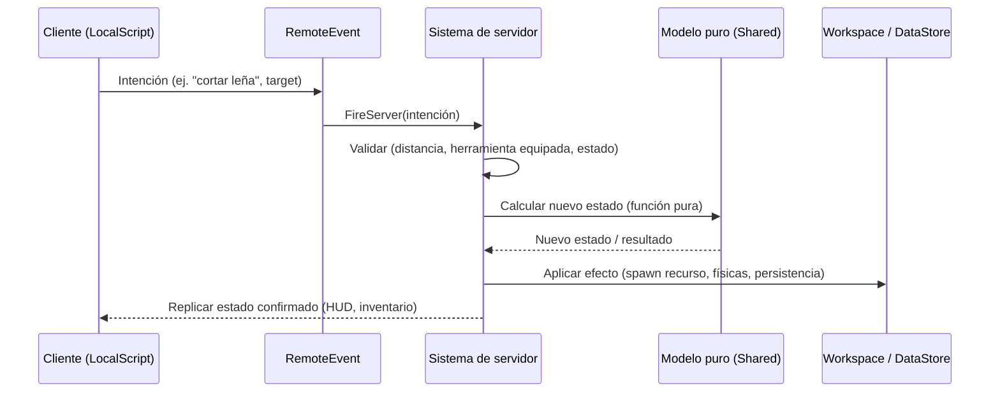

# Documento de Diseño — 7 Días en el Ártico

## Overview

"7 Días en el Ártico" es un juego de supervivencia en primera persona construido sobre **Roblox / Luau**. Se confirma Roblox como motor objetivo porque las mecánicas del requisito (primera persona con brazos y herramienta visible, físicas de caída de troncos y fragmentos, inventario, persistencia entre sesiones y multijugador por servidor) encajan de forma natural con el modelo de Roblox: `Workspace` para el mundo físico, `Players`/`Humanoid` para el jugador, `Tool` para el kit inicial, `RemoteEvent`/`RemoteFunction` para la comunicación cliente-servidor y `DataStoreService` para el guardado automático cada 2 minutos y al salir.

El diseño separa con claridad tres capas:

1. **Capa de lógica pura (Luau)** — módulos sin dependencias del motor que modelan las reglas del juego (consumo de necesidades, capacidad de la neverita, máquina de estados de cocinado, generación validable del mundo, serialización del guardado). Esta capa es la que se somete a *property-based testing*.
2. **Capa de servidor (autoritativa)** — `Script`s en `ServerScriptService` que poseen el estado real de la partida, aplican la lógica pura, resuelven físicas y validan toda acción del cliente.
3. **Capa de cliente (presentación e input)** — `LocalScript`s en `StarterPlayer` que gestionan la cámara en primera persona, el HUD, los sonidos, los menús y el envío de intenciones al servidor.

La regla arquitectónica principal es **servidor autoritativo**: el cliente nunca decide el resultado de una acción (talar, pescar, cocinar, beber); solo envía intención y renderiza el estado que el servidor confirma. Esto evita trampas y mantiene coherente el estado que se guarda en el DataStore.

> Nota importante de alcance: este documento describe arquitectura, componentes, modelos de datos, responsabilidades y propiedades de correctitud. **No incluye implementación de scripts.** Los scripts se solicitarán y escribirán uno a uno en la fase de tareas. Los fragmentos de código de este documento son firmas o pseudocódigo ilustrativo mínimo.

## Architecture

### Distribución en el árbol de Roblox

```
ReplicatedStorage/
  Shared/                     -- Lógica PURA compartida (testeable con PBT)
    Constants.lua             -- Constantes de balance (velocidades, capacidades, tiempos)
    NeedsModel.lua            -- Cálculo de consumo/regeneración de Calor, Hambre, Sed, Salud
    CoolerModel.lua           -- Reglas de la Neverita (capacidad 30)
    BottleModel.lua           -- Estados de la Botella (Llena/Vacía) y beber/rellenar
    CookingModel.lua          -- Máquina de estados crudo->cocinado->quemado
    WeatherModel.lua          -- Temporizador y transición de clima/ventisca
    WorldGenModel.lua         -- Generación y validación de distribución del mundo
    SaveModel.lua             -- Serialización/deserialización y validación del guardado
    Types.lua                 -- Definiciones de tipos Luau (--!strict)
  Remotes/                    -- RemoteEvents y RemoteFunctions declarados
StarterPlayer/
  StarterPlayerScripts/
    CameraController.lua       -- Vista primera persona + brazos/herramienta
    HudController.lua          -- Barras Calor/Hambre/Sed + Salud, transiciones, parpadeo
    MenuController.lua         -- Menú principal, viento en bucle, botón SOBREVIVIR
    TutorialController.lua     -- Tarjeta de instrucciones, pausa, botón ENTENDIDO
    InputRouter.lua            -- Traduce clics/teclas a intenciones (RemoteEvents)
StarterGui/
  ...                          -- Layouts de HUD, menú, tutorial, neverita, rescate
ServerScriptService/
  GameServer.lua               -- Orquestador del ciclo de partida por jugador
  Systems/
    NeedsSystem.lua            -- Aplica NeedsModel en cada tick
    WorldSystem.lua            -- Genera mundo, respawn de árboles/rocas
    WeatherSystem.lua          -- Ejecuta WeatherModel, aplica efectos
    HarvestSystem.lua          -- Talado, minería, físicas de troncos/fragmentos
    DiggingSystem.lua          -- Excavación de cuevas, detección de espacio hueco
    FishingSystem.lua          -- Pesca, agujeros de agua
    CoolerSystem.lua           -- Neverita
    BottleSystem.lua           -- Beber/rellenar
    FireSystem.lua             -- Hoguera de emergencia y de base, cocinado
    BedSystem.lua              -- Cama, punto de reaparición, dormir
    RescueSystem.lua           -- Día 7, helicóptero, modo libre
    SaveSystem.lua             -- Guardado automático (DataStoreService)
```

### Flujo de una acción (patrón general)



### Bucle de simulación

El servidor mantiene un bucle temporal (`Heartbeat`/`RunService`) que, por cada jugador en partida activa, aplica el paso de tiempo `dt` a los sistemas dependientes del tiempo: consumo de necesidades, temporizador de clima, temporizadores de hogueras, cocinado de peces, respawn de recursos y guardado automático. Toda la aritmética temporal vive en los modelos puros, de modo que el bucle solo aporta `dt` y persiste el resultado.

## Components and Interfaces

Las interfaces se expresan como firmas de módulo Luau (no implementación). Todas las funciones de `ReplicatedStorage/Shared` son **puras**: reciben estado y devuelven estado nuevo, sin efectos secundarios ni acceso al motor.

### NeedsModel (lógica pura)

Gestiona Calor, Hambre, Sed y Salud. Aplica las velocidades del Requisito 4, el efecto de nieve/ventisca (doble consumo de Calor) y la caída de Salud cuando alguna necesidad llega a 0.

```lua
-- type Needs = { warmth:number, hunger:number, thirst:number, health:number }
-- type Env = { underSnow:boolean, blizzardExposed:boolean, nearFire:boolean }
NeedsModel.step(needs: Needs, env: Env, dt: number) -> Needs
NeedsModel.applyDrink(needs: Needs, amount: number) -> Needs      -- clamp a 100
NeedsModel.applyEat(needs: Needs, amount: number) -> Needs        -- clamp a 100
NeedsModel.applyBurnedFish(needs: Needs, penalty: number) -> Needs -- clamp a >=0
NeedsModel.isDead(needs: Needs) -> boolean
```

Todos los valores se mantienen en el rango `[0, 100]` mediante *clamp*.

### CoolerModel (lógica pura)

Modela la Neverita con capacidad máxima 30 peces.

```lua
-- type Cooler = { count:number }  -- 0..30
CoolerModel.add(cooler: Cooler) -> (Cooler, ok: boolean)     -- ok=false si lleno
CoolerModel.remove(cooler: Cooler) -> (Cooler, ok: boolean)  -- ok=false si vacío
CoolerModel.isFull(cooler: Cooler) -> boolean
```

### BottleModel (lógica pura)

Estados discretos de la Botella y su efecto sobre la Sed.

```lua
-- type Bottle = { state: "Full" | "Empty" }
BottleModel.drink(bottle: Bottle, needs: Needs) -> (Bottle, Needs, ok: boolean)
BottleModel.refill(bottle: Bottle) -> Bottle
```

### CookingModel (lógica pura)

Máquina de estados del pescado sobre el fuego (Requisito 13).

```lua
-- type FishState = "Raw" | "Cooked" | "Burned"
-- type CookingFish = { state: FishState, timeOnFire: number }
CookingModel.step(fish: CookingFish, dt: number) -> CookingFish
--   Raw -> Cooked a los 10s de cocinado
--   Cooked -> Burned a los +8s adicionales
CookingModel.hungerRestored(fish: CookingFish) -> number   -- 40 si Cooked
CookingModel.healthPenalty(fish: CookingFish) -> number    -- 15 si Burned
```

### WeatherModel (lógica pura)

Temporizador de clima y ciclo de ventisca (Requisito 6).

```lua
-- type Weather = { timer:number, blizzardActive:boolean, blizzardRemaining:number }
WeatherModel.step(weather: Weather, dt: number, rng: () -> number) -> Weather
--   timer llega a 0 -> activa ventisca, reinicia timer a 600, blizzardRemaining=60
--   blizzardRemaining llega a 0 -> desactiva ventisca
WeatherModel.visibilityFactor(weather: Weather) -> number   -- 0.3 si ventisca, 1.0 si no
```

### WorldGenModel (lógica pura)

Genera y **valida** la distribución del mundo (Requisito 5). La generación es determinista dada una semilla, lo que permite testear las restricciones.

```lua
-- type Placement = { x:number, y:number, kind:"stone"|"tree" }
-- type World = { size:number, lakes:{Region}, perimeter:number, placements:{Placement} }
WorldGenModel.generate(seed: number) -> World
WorldGenModel.validate(world: World) -> (ok: boolean, reason: string?)
--   40 piedras, 60 árboles, separación mínima 2, sin solape, sin invadir perímetro (>=20)
```

### SaveModel (lógica pura)

Serialización del estado persistente (Requisito 16). No accede a DataStore; solo transforma datos.

```lua
-- type SaveData = { pos:Vector3ish, day:number, wood:number, stone:number,
--                    coolerFish:number, freeMode:boolean, version:number }
SaveModel.serialize(state: SaveData) -> string        -- JSON
SaveModel.deserialize(raw: string) -> (SaveData?, ok: boolean)  -- valida integridad
SaveModel.isValid(data: SaveData) -> boolean
```

### Interfaces cliente-servidor (Remotes)

| Remote | Tipo | Dirección | Propósito |
|--------|------|-----------|-----------|
| `StartSurvival` | RemoteEvent | C→S | Pulsar SOBREVIVIR / cerrar tutorial |
| `HarvestAction` | RemoteEvent | C→S | Golpear árbol/roca, cortar leña, minar fragmento |
| `DigAction` | RemoteEvent | C→S | Excavar cubo de nieve |
| `FishingAction` | RemoteEvent | C→S | Lanzar caña, sacar pez |
| `ConsumeAction` | RemoteEvent | C→S | Beber, comer pez, rellenar botella |
| `FireAction` | RemoteEvent | C→S | Soltar madera, encender, alimentar hoguera |
| `BedAction` | RemoteEvent | C→S | Colocar cama, fijar respawn, dormir |
| `RescueChoice` | RemoteEvent | C→S | Escapar / Seguir sobreviviendo |
| `StateUpdate` | RemoteEvent | S→C | Replicar necesidades, inventario, clima al HUD |
| `GetSaveState` | RemoteFunction | C→S | Consultar estado inicial al entrar |

Todas las acciones C→S se **validan en el servidor** (herramienta equipada correcta, distancia, precondiciones de estado) antes de aplicar la lógica pura.

## Data Models

### Estado del jugador (autoritativo, en servidor)

```lua
type PlayerState = {
    userId: number,
    needs: Needs,              -- warmth, hunger, thirst, health (0..100)
    inventory: Inventory,      -- herramientas + recursos apilables
    cooler: Cooler,            -- count 0..30
    bottle: Bottle,            -- "Full" | "Empty"
    day: number,               -- 1..N (N>=7 en modo libre)
    freeMode: boolean,
    respawnBedId: string?,     -- nil => punto por defecto
    lastSaveClock: number,     -- para el temporizador de 120s
}
```

### Inventario y recursos

```lua
type Inventory = {
    tools: { [string]: boolean },  -- Pala, Hacha, Pico, Caña, Neverita, Cama, Botella (7)
    wood: number,                  -- >= 0
    stone: number,                 -- >= 0
    capacity: number,              -- límite de recursos apilables
}
```

El kit inicial (Requisito 3) es exactamente las 7 herramientas, una unidad de cada una, con la Botella al 100%.

### Estado del mundo (autoritativo, en servidor)

```lua
type WorldState = {
    seed: number,
    trees: { [id]: TreeNode },     -- hits, felled, felledAt, position
    rocks: { [id]: RockNode },     -- hits, destroyed, destroyedAt, position
    waterHoles: { [id]: Vector3 }, -- agujeros creados al romper hielo
    caves: { CaveVolume },         -- espacios huecos registrados como cueva
    weather: Weather,
}
```

### Estado de fuego y cocinado

```lua
type EmergencyFire = { position: Vector3, ignitedAt: number }  -- vive 45s
type BaseFire = {
    position: Vector3, lit: boolean,
    woodStock: number,             -- 0..20
    cooking: { CookingFish },      -- máximo 5 simultáneos
}
```

### Datos persistidos (DataStore)

Solo se persiste el subconjunto del Requisito 16.3: posición del jugador, día, madera, piedra, peces de la neverita y estado de modo libre. Incluye un campo `version` para migraciones y detección de corrupción.

```lua
type SaveData = {
    version: number,
    pos: { x:number, y:number, z:number },
    day: number,
    wood: number,
    stone: number,
    coolerFish: number,   -- 0..30
    freeMode: boolean,
}
```

### Constantes de balance (extracto)

| Constante | Valor | Requisito |
|-----------|-------|-----------|
| Consumo Hambre / Sed | 1%/s | 4.5, 4.6 |
| Multiplicador Calor bajo nieve / ventisca | ×2 | 4.3, 6.6 |
| Caída de Salud con necesidad a 0 | 5%/s | 4.7 |
| Golpes para talar/minar | 5 | 7.1, 7.4 |
| Madera por tronco | 3 | 7.3 |
| Respawn de árbol/roca | 60 s | 7.6, 7.7 |
| Capacidad Neverita | 30 | 10.2 |
| Recuperación al beber | +40 Sed | 11.1 |
| Duración hoguera emergencia | 45 s | 12.6 |
| Calor de hoguera emergencia | +10/s (radio 5 m) | 12.5 |
| Piedra / Madera para hoguera base | 5 / 3 | 13.1, 13.3 |
| Tope de madera en hoguera base | 20 | 13.6 |
| Peces cocinándose a la vez | 5 | 13.7 |
| Crudo→Cocinado / Cocinado→Quemado | 10 s / +8 s | 13.8, 13.10 |
| Recuperación al comer pez cocinado | +40 Hambre | 13.9 |
| Penalización pez quemado | −15 Salud | 13.11 |
| Intervalo de cambio de clima | 600 s | 6.1 |
| Duración de ventisca | 60 s | 6.3 |
| Intervalo de guardado | 120 s | 16.1 |
| Día de rescate | 7 | 15.1 |

## Correctness Properties

*Una propiedad es una característica o comportamiento que debe cumplirse en todas las ejecuciones válidas del sistema; en esencia, un enunciado formal sobre lo que el sistema debe hacer. Las propiedades sirven de puente entre las especificaciones legibles por personas y las garantías de correctitud verificables por máquina.*

Las siguientes propiedades se derivan de los módulos de **lógica pura** de `ReplicatedStorage/Shared` (NeedsModel, CoolerModel, BottleModel, CookingModel, WeatherModel, WorldGenModel, SaveModel). Son funciones deterministas sin dependencias del motor, por lo que se prestan a *property-based testing* con entradas generadas aleatoriamente. Los criterios ligados a UI, físicas del motor, temporización visual o integración con DataStore no aparecen aquí: se validan con pruebas de ejemplo, integración y playtest (ver Testing Strategy).

### Property 1: Las necesidades permanecen acotadas en [0, 100]

*Para todo* estado de necesidades y entorno, y para toda secuencia de operaciones de `NeedsModel` (`step`, `applyDrink`, `applyEat`, `applyBurnedFish`) con cualquier `dt >= 0`, los valores de `warmth`, `hunger`, `thirst` y `health` permanecen siempre dentro del rango cerrado [0, 100].

**Validates: Requirements 4.1**

### Property 2: El Calor se consume al doble bajo nieve o ventisca

*Para todo* estado de necesidades y todo `dt >= 0`, la disminución de `warmth` producida por `NeedsModel.step` con un entorno de doble consumo (`underSnow` o `blizzardExposed`) es exactamente el doble que la producida por el mismo estado y `dt` en condiciones normales, respetando el clamp inferior en 0.

**Validates: Requirements 4.3, 6.6**

### Property 3: Hambre y Sed disminuyen de forma proporcional al tiempo

*Para todo* estado de necesidades y todo `dt >= 0`, en ausencia de efectos externos, `NeedsModel.step` reduce `hunger` y `thirst` proporcionalmente a `dt` a razón de 1% por segundo, sin bajar de 0.

**Validates: Requirements 4.5, 4.6**

### Property 4: La Salud decae mientras una necesidad está agotada

*Para todo* estado de necesidades en el que al menos una de `warmth`, `hunger` o `thirst` valga 0, `NeedsModel.step` reduce `health` a razón de 5% por segundo por cada `dt`, sin bajar de 0.

**Validates: Requirements 4.7**

### Property 5: La restauración aditiva de necesidades nunca desborda 100

*Para todo* estado de necesidades y toda cantidad de restauración, beber (`applyDrink`, +40 Sed) y comer pez cocinado (`applyEat`, +40 Hambre) fijan el valor resultante en `min(100, valor_previo + cantidad)`, sin superar nunca 100.

**Validates: Requirements 11.1, 11.2, 13.9**

### Property 6: La penalización por pez quemado nunca baja de 0

*Para todo* estado de necesidades, `applyBurnedFish` (−15 Salud) fija la salud resultante en `max(0, salud_previa − penalización)`, sin bajar nunca de 0.

**Validates: Requirements 13.11**

### Property 7: La Neverita respeta su capacidad y señala lleno/vacío correctamente

*Para toda* secuencia de operaciones `add`/`remove` sobre una Neverita, el contador se mantiene siempre en el rango [0, 30]; `add` devuelve `ok = false` exactamente cuando el contador vale 30 (dejándolo intacto) y `remove` devuelve `ok = false` exactamente cuando vale 0.

**Validates: Requirements 10.2, 10.3, 10.4**

### Property 8: La máquina de estados de cocinado transita en orden y es confluente en el tiempo

*Para toda* secuencia de pasos de tiempo aplicada a un pez sobre el fuego, `CookingModel.step` transita `Raw → Cooked` exactamente al acumular 10 s y `Cooked → Burned` exactamente al acumular 18 s (10 + 8), sin saltarse nunca el estado `Cooked`; además, el estado final depende solo del tiempo total acumulado y no de cómo se trocee el `dt` (confluencia).

**Validates: Requirements 13.8, 13.10**

### Property 9: El temporizador de clima se reinicia a 600 y la ventisca dura 60 s

*Para todo* estado de clima y todo `dt >= 0`, cuando el temporizador llega a 0, `WeatherModel.step` activa la ventisca, reinicia el temporizador a 600 s y fija `blizzardRemaining` en 60 s; y la ventisca se desactiva exactamente cuando `blizzardRemaining` alcanza 0.

**Validates: Requirements 6.1, 6.2, 6.3**

### Property 10: La generación del mundo cumple las restricciones de distribución

*Para toda* semilla, `WorldGenModel.generate` produce un mundo con exactamente 40 piedras y 60 árboles, sin solapamientos, con una separación mínima de 2 bloques entre elementos y sin invadir la banda perimetral (>= 20 bloques); y `WorldGenModel.validate` acepta ese mundo (o, si alguna restricción no puede satisfacerse, `validate` devuelve `false` de forma coherente con la razón).

**Validates: Requirements 5.2, 5.3, 5.4, 5.5**

### Property 11: El guardado preserva los datos en un ciclo serializar → deserializar

*Para todo* `SaveData` válido, `SaveModel.deserialize(SaveModel.serialize(x))` devuelve `ok = true` y un objeto igual a `x` campo a campo, preservando `pos`, `day`, `wood`, `stone`, `coolerFish` y `freeMode`.

**Validates: Requirements 16.3, 16.4**

### Property 12: Los guardados corruptos o incompletos se detectan

*Para toda* cadena mal formada o con campos persistidos faltantes o fuera de rango, `SaveModel.deserialize` devuelve `ok = false` e `isValid` devuelve `false`, sin producir un `SaveData` parcialmente válido.

**Validates: Requirements 16.7**

## Error Handling

El diseño es **servidor autoritativo**: el cliente solo envía intenciones y el servidor valida cada acción antes de aplicar la lógica pura. Toda ruta de error definida en los requisitos se resuelve rechazando la acción en el servidor, conservando el estado previo y devolviendo al cliente una señal para mostrar la retroalimentación correspondiente. Ninguna validación de éxito ocurre en el cliente.

### Validación de acciones cliente → servidor

Cada `RemoteEvent` entrante pasa por un guardián de validación en su sistema de servidor antes de tocar el estado. Si la validación falla, el sistema no modifica el estado autoritativo y responde con un `StateUpdate` que incluye el motivo del rechazo para que el HUD muestre el aviso. Casos cubiertos:

| Situación de error | Requisito | Manejo en el servidor |
|--------------------|-----------|-----------------------|
| Golpear Árbol con herramienta distinta al Hacha, o Roca con herramienta distinta al Pico | 7.8 | No incrementa el contador de golpes; el objeto queda intacto; sin efecto de estado. |
| Otorgar Madera/Piedra con Inventario lleno | 7.9 | El recurso se deja como objeto físico en el suelo; se envía señal de "inventario lleno" al HUD. |
| Añadir/recoger Pez con Neverita llena (30) | 10.4 | `CoolerModel.add` devuelve `ok = false`; el contador se mantiene en 30; el Pez queda en el mundo; mensaje de "Neverita llena" durante >= 3 s. |
| Beber con la Botella vacía | 11.4 | `BottleModel.drink` devuelve `ok = false`; `Needs` sin cambios; señal de "Botella vacía". |
| Excavar sobre roca o hielo con la Pala | 8.4 | No se retira ningún cubo; terreno intacto; señal de "material no excavable". |
| Excavar donde la nieve tiene menos de 1 cubo de profundidad | 8.5 | No se retira ningún cubo; terreno intacto; señal de "no hay nieve suficiente". |
| Lanzar la Caña sobre una casilla que no es agua de un Agujero_Agua | 9.6 | No se inicia la cuenta de 5 s; la Caña queda sin lanzar. |
| Soltar Madera sin Madera disponible | 12.2 | No se crea Tronco; Inventario sin cambios; señal de "sin Madera". |
| Encender Tronco sin Mechero equipado o a más de 3 m | 12.4 | El Tronco permanece sin encender; sin efecto de estado. |
| Colocar el plano de Hoguera_Base con menos de 5 Piedra | 13.2 | Se rechaza la colocación; Inventario sin cambios; señal de "se necesitan 5 Piedra". |
| Encender la Hoguera_Base sin Mechero equipado | 13.5 | No se crea la Hoguera_Base; la Madera del centro se conserva. |
| Colocar la Cama fuera de base/Cueva o en superficie no válida | 14.2 | Se rechaza la colocación; la Cama no se fija; retroalimentación visual de ubicación no válida. |
| Intentar dormir cuando no es de noche | 14.7 | No se acelera el tiempo; retroalimentación de "solo puedes dormir de noche". |
| Kit inicial incompleto al comenzar la partida | 3.5 | Se impide iniciar la partida activa; mensaje de fallo en la creación del kit; no se deja un estado jugable parcial. |
| La generación del Mundo no cumple restricciones tras 3 reintentos | 5.6 | `WorldGenModel.validate` devuelve `false`; se impide iniciar la partida; mensaje de fallo de generación del mapa. |

Estas rutas de rechazo se apoyan en los resultados `(estado, ok)` de los modelos puros (`CoolerModel`, `BottleModel`, `WorldGenModel`), lo que permite comprobar la condición de error de forma determinista y aislada de los efectos del motor.

### Fallos del sonido y arranque no bloqueante

Si el sonido de viento del menú no puede reproducirse (1.5), el `MenuController` continúa mostrando la escena y el botón "SOBREVIVIR" sin bloquear el arranque; el fallo de audio se trata como no crítico y se registra, pero no interrumpe el flujo.

### Persistencia y DataStore (SaveSystem)

El `SaveSystem` es la única capa con efectos de I/O contra `DataStoreService`. Toda la transformación de datos ocurre en `SaveModel` (puro); el sistema solo orquesta lectura/escritura y gestiona los fallos del servicio:

- **Fallo de guardado (16.5):** las escrituras a DataStore se realizan dentro de `pcall`. Si la operación lanza o agota reintentos, el `SaveSystem` conserva intacto el último guardado válido (no se sobrescribe con datos parciales) y notifica al jugador que el guardado no se completó. El siguiente ciclo de 120 s vuelve a intentarlo.
- **Sin partida guardada (16.6):** si la lectura devuelve `nil`, se inicia una partida nueva desde el Día 1 con el kit inicial completo.
- **Guardado corrupto o incompleto (16.7):** el `raw` recuperado se pasa por `SaveModel.deserialize`. Si devuelve `ok = false` (JSON inválido, campos faltantes, `version` desconocida o valores fuera de rango como `coolerFish` > 30), el servidor descarta esos datos, muestra el aviso de partida corrupta e inicia una partida nueva desde el Día 1. El campo `version` habilita además la detección temprana de formatos incompatibles.

Al guardar (16.1, 16.2), el `SaveSystem` serializa solo el subconjunto persistido (posición, día, madera, piedra, peces de la Neverita y estado de modo libre) mediante `SaveModel.serialize`, garantizando por la Propiedad 11 que un ciclo serializar → deserializar preserva exactamente esos campos.

## Testing Strategy

La estrategia combina **pruebas basadas en propiedades** para la lógica pura, **pruebas de ejemplo (unitarias)** para casos concretos y bordes, y **pruebas de integración/playtest** para las físicas, la UI y la persistencia real. La separación en tres capas (lógica pura, servidor, cliente) es lo que hace testeable el núcleo: los módulos de `ReplicatedStorage/Shared` son funciones deterministas sin acceso al motor, de modo que pueden ejecutarse de forma repetible y aislada, sin `Workspace`, sin `DataStore` y sin red.

### Marco de pruebas

- **Framework base:** **TestEZ** (el runner de pruebas estándar del ecosistema Roblox/Luau), ejecutable en local con **Lune** o **run-in-Roblox** para CI, o dentro de Roblox Studio.
- **Property-based testing:** al no existir un estándar consolidado de PBT para Luau equivalente a QuickCheck/Hypothesis/fast-check, se usará un **ayudante ligero de generación aleatoria sobre TestEZ**: generadores deterministas sembrados (semilla registrada en cada fallo para reproducir el contraejemplo) que producen `Needs`, `Env`, `dt`, secuencias de operaciones de Neverita, semillas de mundo y `SaveData`. Cada propiedad se implementa como **una única prueba** que ejecuta el generador un mínimo de **100 iteraciones**. Si más adelante se adopta una librería de PBT dedicada para Luau, la capa de generadores se sustituye sin cambiar los enunciados de las propiedades.

### Pruebas de propiedades (capa Shared, pura)

Cada una de las 12 propiedades de la sección Correctness Properties se implementa con **una sola prueba de propiedad** que corre **>= 100 iteraciones** con entradas generadas. Cada prueba se etiqueta con un comentario que referencia la propiedad del diseño, con el formato:

**Feature: juego-supervivencia-artico, Property {número}: {texto de la propiedad}**

Cobertura por módulo:

- **NeedsModel:** Propiedades 1–6 (invariante de rango, doble consumo de Calor, tasa de hambre/sed, daño a la salud, restauración aditiva sin desbordar, penalización sin bajar de 0).
- **CoolerModel:** Propiedad 7 (capacidad e indicadores de lleno/vacío).
- **CookingModel:** Propiedad 8 (transiciones ordenadas y confluencia temporal).
- **WeatherModel:** Propiedad 9 (reinicio del temporizador y duración de ventisca).
- **WorldGenModel:** Propiedad 10 (conteos, separación mínima, sin invasión de perímetro).
- **SaveModel:** Propiedades 11 y 12 (round-trip de serialización y detección de corrupción).

Los generadores incluyen deliberadamente casos límite: `dt = 0` y `dt` grandes, necesidades en los extremos 0 y 100, Neverita en 0 y 30, tiempos de cocinado justo en los umbrales (10 s y 18 s), `blizzardRemaining` en 0, mundos con semillas variadas y `SaveData` con campos fuera de rango o ausentes.

### Pruebas unitarias (de ejemplo)

Se usan para comportamientos concretos y bordes que no requieren cuantificación universal, evitando duplicar la cobertura que ya aportan las propiedades:

- Constantes de balance de `Constants.lua` (valores exactos: 5 golpes, 3 maderas por tronco, +40 al beber, etc.).
- Transiciones puntuales de `BottleModel` (Llena → beber → Vacía → rellenar → Llena) y su efecto en la Sed.
- Casos de rechazo de los guardianes de validación del servidor (tabla de Error Handling): herramienta incorrecta, inventario lleno, Neverita llena, Botella vacía, recursos insuficientes para la Hoguera_Base, dormir de día, ubicación de Cama no válida.
- Ramas del `SaveSystem`: sin partida guardada (Día 1 nuevo), guardado corrupto (Día 1 nuevo), fallo de escritura (conservación del guardado anterior).

### Pruebas de integración y playtest

Para lo que depende del motor, la física o la percepción, que no es amenable a PBT:

- **Físicas y mundo (Requisitos 7, 8, 9, 12):** caída de troncos por gravedad, fragmentación de rocas, creación de Agujero_Agua, encendido y expiración de hogueras, radio de calor. Se validan con playtests guiados y 1–3 escenarios de integración en Studio.
- **UI/HUD (Requisitos 1, 2, 3, 4.2, 4.4, 6.4, 6.5):** menú, tutorial con pausa, cámara en primera persona, transiciones y parpadeo de barras, niebla y sonido de ventisca. Se validan con pruebas de ejemplo sobre los controladores y revisión visual/playtest.
- **Ciclo de juego (Requisitos 14, 15, 16.1, 16.2):** dormir, reaparición, llegada del helicóptero, modo libre y guardado automático real contra `DataStoreService`. Se cubren con pruebas de integración de extremo a extremo (1–3 ejemplos) usando el DataStore de pruebas de Studio.

### Cómo la separación pura habilita el testeo determinista

Al residir toda la aritmética temporal y de reglas en los módulos puros (que reciben estado y `dt` y devuelven estado nuevo), las pruebas pueden inyectar `dt` fijos y semillas de RNG controladas para obtener resultados 100% reproducibles, sin depender del bucle `Heartbeat`, del reloj real ni de servicios del motor. El bucle de simulación del servidor solo aporta `dt` y persiste el resultado, de modo que verificar los modelos puros verifica el corazón de las reglas del juego; la capa de servidor y cliente se comprueba por separado con integración y playtest.

> Nota de alcance: como en el resto del documento, aquí no se incluye implementación de scripts ni de pruebas. Los scripts (incluidos los de prueba) se solicitarán y escribirán uno a uno en la fase de tareas.
